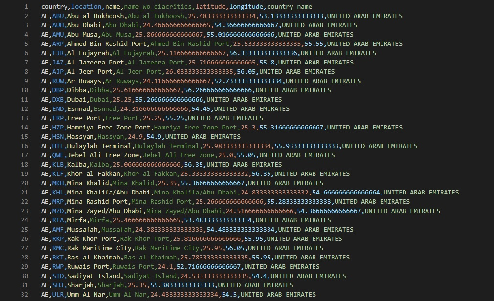

# Extract ports from UNLOCODE datasets

**extract ports.ipynb** notebook allows to extract ports only from unlocode dataset.

Datasets can be downloaded from UNECE website: http://www.unece.org/cefact/codesfortrade/codes_index.html

Result of the notebook can be found in **unlocode_ports.csv** file.

